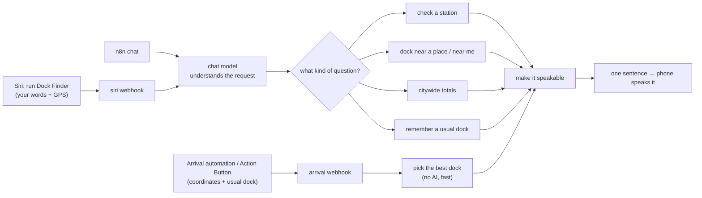

# Citi Bike Smart Dock Assistant

A hands-free helper for Citi Bike riders in NYC. As you get close to where you're going, it tells you **through your headphones** which nearby dock actually has space, so you never have to pull out your phone while riding.

> "your usual dock is full. go to Washington and Greene, 8 docks, 100 meters from school."

Built as a group capstone project with [n8n](https://n8n.io), iPhone Shortcuts + Siri, Citi Bike's public live feed, and OpenStreetMap.

## The problem

Riding to class, we kept arriving to find the nearby docks already full. Then you have to stop, unlock your phone, open the Citi Bike app and hunt for another station, which is annoying and unsafe on a bike. We wanted something that checks live availability, remembers the docks you normally use, and reroutes you before you get there, entirely by voice.

## Ways to use it

| Mode | How you trigger it | What happens |
|---|---|---|
| **Arrival alert** | Automatic: an iPhone "Arrive" automation fires ~500 m from school, work or home | Speaks whether your usual dock has room, and if not, where to go instead |
| **Dock Finder (Siri)** | "Hey Siri, run Dock Finder", then ask anything | "find me a dock near me", "is Mercer and Bleecker full?", "find me a dock near Union Square", "how many bikes are out?" |
| **Action Button** | One press | Nearest dock with space to where you are right now |
| **Chat** | n8n's built-in chat window | Fuller text answers with Google Maps cycling directions |

### What it says (real responses from live data)

| Situation | Spoken answer |
|---|---|
| Usual dock OK | "your usual dock has 25 docks open." |
| Usual dock full | "your usual dock is full. go to Washington and Greene, 8 docks, 100 meters from school." |
| Near me | "West 15th and 6th has 53 docks open, right there." |
| Station check | "Mercer and Bleecker has 29 docks open." |
| Near a place | "East 17th and Broadway has 47 docks open, 150 meters from union square." |
| Whole system | "35,393 bikes and 30,882 open docks citywide. 243 stations are full." |

Station names are rewritten the way New Yorkers say them ("W 15 St & 6 Ave" becomes "West 15th and 6th"), so Siri doesn't read "St" as "Saint".

## How it works

The iPhone does the listening and the talking; one n8n workflow does the thinking. Every request ends in a single plain-text sentence that the phone reads aloud with its built-in voice.



- **Live data:** Citi Bike's public [GBFS feed](https://gbfs.lyft.com/gbfs/2.3/bkn/en/) (no API key). A station counts as available only if it's accepting returns and has **at least 2** open docks, within 1.2 km.
- **Place lookup:** [OpenStreetMap Nominatim](https://nominatim.org/) turns "NYU Stern" or "270 Park Avenue" into coordinates. The AI rewrites landmarks into street addresses first, because the geocoder only matches addresses and official names.
- **Understanding requests:** a small chat model classifies what you said into one of six intents (`station`, `place`, `gps`, `network`, `remember`, `help`) and extracts station names and places into a fixed JSON schema. **It never writes the answer**; plain JavaScript does, so every number comes straight from the live feed. We've run it on Claude Haiku 4.5 and GPT-6 Luna; any fast, non-reasoning model works.
- **Arrival alerts skip the AI entirely.** Their inputs are fixed, so they answer in ~2–3 s. Siri questions take ~3–6 s.
- **Memory:** the Siri conversation remembers aliases like "my school dock is Mercer and Bleecker". Arrival automations carry their usual dock in the request itself.

## Repo layout

```
n8n/
  citibike-smart-dock-assistant.workflow.json   # import this into n8n
  code-nodes/                                    # readable copies of the workflow's JavaScript nodes
docs/
  onboarding.md                                  # start here as a new rider
  shortcuts.md                                   # how every shared shortcut works, step by step (auto-updated on each push)
  iphone-setup-handoff.md                        # Shortcuts-only iPhone setup, written for an AI assistant to walk a rider through
  project-summary.pdf                            # one-page-per-topic project overview
shortcuts/
  build_shortcuts.py                             # builds the signed, shareable .shortcut files (output in shortcuts/dist/, gitignored)
  generate_docs.py                               # regenerates docs/shortcuts.md (CI runs it on every push)
ios/
  biker-app.xcodeproj                            # native SwiftUI "Dock Finder" app: dock logic runs on the iPhone, n8n only for free-form questions; see ios/README.md
  biker-app/                                     # app source
  DockFinderTests/                               # unit tests
```

The workflow JSON is the source of truth; `code-nodes/` holds copies of the six Code nodes so the logic is easy to read and review on GitHub.

To try the native iOS app (developer preview) on your own iPhone, follow [Testing the developer preview on your own iPhone](ios/README.md#testing-the-developer-preview-on-your-own-iphone).

## Set it up

**New rider? Start with [docs/onboarding.md](docs/onboarding.md).** Riders add a few shortcut files a teammate sends them, answer two questions, and make one automation per place: no URLs or coordinates. Whoever shares the files builds them with `shortcuts/build_shortcuts.py`. The steps below set up the shared n8n backend, which Path B needs and the app uses for free-form questions.

### 1. Backend (n8n)

1. In n8n (Cloud or self-hosted), create a workflow, then **⋯ → Import from File** and pick `n8n/citibike-smart-dock-assistant.workflow.json`.
2. Open the chat model node attached to **understand request** and pick your model and credential (OpenAI, Anthropic, etc.). If a model offers a reasoning-effort setting, use the lowest.
3. **Save** and **Publish**.
4. Copy the **Production URL** from the **siri webhook** and **arrival webhook** nodes (use `/webhook/`, not `/webhook-test/`).

Quick test from a terminal:

```bash
curl -X POST "https://YOUR-N8N-HOST/webhook/citibike-arrival" -H "Content-Type: application/json" -d '{"lat":40.738,"lon":-73.996}'
```

### 2. iPhone

See [docs/onboarding.md](docs/onboarding.md). For the Shortcuts-only path: open [`docs/iphone-setup-handoff.md`](docs/iphone-setup-handoff.md), replace `https://YOUR-N8N-HOST` with your n8n address, then attach it to ChatGPT or Claude and say "help me set this up on my iPhone". It covers the required iPhone settings, the arrival automations, the Dock Finder Siri shortcut, and a troubleshooting table of every mistake we hit. You need iOS 17 or newer and about 15 minutes.

**Webhook URLs have no authentication.** Anyone with them can query the assistant and spend your AI credits on Siri requests. Share filled-in copies only with people you trust.

## Decisions we made

- **Trigger near saved places, not the Google Maps destination.** Google Maps doesn't expose your navigation destination or live position to other apps, so iPhone "Arrive" automations for commute destinations give a fully automatic trigger without building an App Store app.
- **Siri + Shortcuts instead of a Telegram bot.** Our first voice prototype used Telegram, but voice notes need the phone unlocked and a button held, and replies don't auto-play. Siri is truly hands-free, and the phone does speech recognition and text-to-speech for free.
- **Spoken-first answers.** Anything spoken is one sentence: where to go, how many docks, how far.
- **AI only where it helps.** Fixed-input paths (arrival, Action Button) are plain code; only free-form questions go through a model.

## Costs

| Piece | Cost |
|---|---|
| Citi Bike feed, OpenStreetMap lookups, iPhone speech | Free |
| Chat model per Siri question | ≈ $0.002 or less (arrival alerts use none) |
| n8n hosting | n8n Cloud plan, or free/self-hosted |

## Limitations and next steps

- Arrival alerts fire however you arrive (walking, subway). iOS can't tell you're biking, so a time window is the only filter.
- Distances are straight-line, not riding distance.
- The closest dock with ≥2 spaces wins, even if a much roomier one is only slightly farther. Next: prefer stations with a bigger buffer when they're nearly as close.
- Siri conversation memory is in n8n's in-memory store and resets on restart.
- Ideas: move the backend to a free serverless function that caches the station list for faster answers; keep each rider's saved places on the server so automations need one action; a native app that sets an arrival alert for *any* destination shared from Google Maps.

## Credits

Data: Citi Bike / Lyft [GBFS](https://github.com/MobilityData/gbfs) feed, © [OpenStreetMap](https://www.openstreetmap.org/copyright) contributors. This is a student project and is not affiliated with Citi Bike, Lyft, or Apple.
