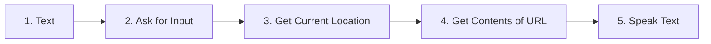
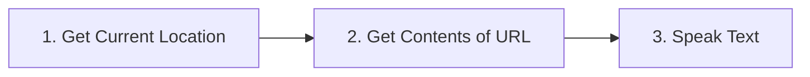
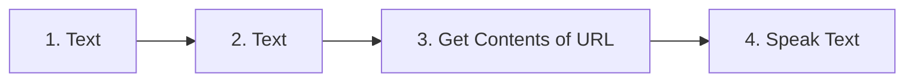

# Dock Finder shortcuts: how each one works

This is the reference for the iPhone shortcuts the group shares: what each one is for, what triggers it, every step it runs, exactly what it sends to the server, what the server does with it, and what the rider should hear.

**This file keeps itself up to date.** Everything between the `generated` markers below is rebuilt from the code on every push to GitHub (see [Keeping this file current](#keeping-this-file-current)), so it always matches what `shortcuts/build_shortcuts.py` actually builds and what the n8n workflow actually does. Only edit the hand-written sections outside the markers.

New rider setting up a phone? Use [onboarding.md](onboarding.md) instead. This file is for the people building and debugging it.

## The big picture

1. A rider triggers a shortcut: Siri, the Action Button, or an Arrive automation.
2. The shortcut gathers what the server needs (what you said, your GPS position, or the address of your destination) and sends it as JSON to one of the group's two n8n webhooks.
3. n8n reads Citi Bike's live dock data, picks the best dock, and replies with **one plain-text sentence**.
4. The shortcut's last step, **Speak Text**, reads that sentence aloud through whatever audio output is connected (AirPods, headphones, or the speaker).

Shortcuts never compute anything about docks themselves. All dock logic lives in the n8n Code nodes (`n8n/code-nodes/`), so fixing a dock rule never requires re-sharing shortcuts. Shortcuts only need re-sharing when **what they send** changes: the URL, a JSON field, a step.

## How each shortcut should behave

Use these to check a shortcut is working. The numbers change with live data; the shape of the sentence shouldn't.

| Shortcut | Situation | What the rider should hear |
|---|---|---|
| Dock Finder | "find me a dock near me" | "West 15th and 6th has 53 docks open, right there." |
| Dock Finder | "is Mercer and Bleecker full?" (has space) | "Mercer and Bleecker has 29 docks open." |
| Dock Finder | "is Mercer and Bleecker full?" (full) | "Mercer and Bleecker is full. go to Bleecker and Crosby, 19 docks, 150 meters away." |
| Dock Finder | "find me a dock near Union Square" | "East 17th and Broadway has 47 docks open, 150 meters from union square." |
| Dock Finder | "how many bikes are out?" | "35,393 bikes and 30,882 open docks citywide. 243 stations are full." |
| Dock Finder | "my school dock is Mercer and Bleecker" | "got it, Mercer St & Bleecker St is your school dock." |
| Nearest Dock | any time | "West 15th and 6th has 56 docks open, right there." |
| Dock Arrival | usual dock has space | "your usual dock has 25 docks open." |
| Dock Arrival | usual dock full | "your usual dock is full. go to Washington and Greene, 8 docks, 100 meters from school." |
| Dock Arrival | no usual dock set | "Washington and Greene has 8 docks open, 100 meters from school." |
| any | nothing with space within 1.2 km | "no docks with space near school." |

Timing: Nearest Dock and Dock Arrival skip the AI and answer in about 2–3 seconds. Dock Finder goes through the AI model first and takes about 3–6 seconds.

<!-- generated:start -->

<!-- Everything between these markers is rewritten by shortcuts/generate_docs.py. Edit shortcuts/build_shortcuts.py, the n8n workflow, or the app instead. -->

## Shortcut reference

5 shared shortcuts, defined in `shortcuts/build_shortcuts.py`:

| Shortcut | How it runs |
|---|---|
| [Dock Finder](#1-dock-finder) | Say "Hey Siri, run Dock Finder", then answer the question out loud. |
| [Nearest Dock](#2-nearest-dock) | Press the Action Button (Settings → Action Button → Shortcut), or tap it. |
| [Dock Arrival - School](#3-dock-arrival---school) | Runs by itself from an Arrive automation set ~500 m around the rider's school. |
| [Dock Arrival - Work](#4-dock-arrival---work) | Runs by itself from an Arrive automation set ~500 m around the rider's work. |
| [Dock Arrival - Home](#5-dock-arrival---home) | Runs by itself from an Arrive automation set ~500 m around the rider's home. |

### 1. Dock Finder

- **What it does:** Hey Siri, run Dock Finder: asks what you need, sends it with your location.
- **How it runs:** Say "Hey Siri, run Dock Finder", then answer the question out loud.

**Setup questions** (asked once, when the rider adds the shortcut):

| # | Question | Fills step |
|---|---|---|
| 1 | Your first name (keeps your Dock Finder memory separate from everyone else's) | 1 (Text) |

**Steps, in order:**

| Step | Action | What it does | Output |
|---|---|---|---|
| 1 | Text | Holds the answer to setup question 1 | Output: **Text** |
| 2 | Ask for Input | Siri asks **"What do you need?"** and listens (input type: Text) | Output: **Provided Input** (what the rider said) |
| 3 | Get Current Location | Gets the phone's GPS position (needs Location permission for Shortcuts, Precise on) | Output: **Current Location** |
| 4 | Get Contents of URL | **POST** `https://YOUR-N8N-HOST/webhook/citibike-siri`, Request Body **JSON** (fields below) | Output: **Contents of URL** (the server's one-sentence reply, plain text) |
| 5 | Speak Text | Speaks **Contents of URL** from step 4 through the current audio output (AirPods/headphones). Wait Until Finished: **on** | Last step |

**Request sent** (step 4): `POST https://YOUR-N8N-HOST/webhook/citibike-siri`

| JSON field | Value |
|---|---|
| `text` | **Provided Input** from step 2 |
| `lat` | **Current Location** from step 3 → Latitude |
| `lon` | **Current Location** from step 3 → Longitude |
| `sessionId` | **Text** from step 1 |

### 2. Nearest Dock

- **What it does:** One press (Action Button): nearest dock with space to where you are.
- **How it runs:** Press the Action Button (Settings → Action Button → Shortcut), or tap it.

**Setup questions** (asked once, when the rider adds the shortcut):

None.

**Steps, in order:**

| Step | Action | What it does | Output |
|---|---|---|---|
| 1 | Get Current Location | Gets the phone's GPS position (needs Location permission for Shortcuts, Precise on) | Output: **Current Location** |
| 2 | Get Contents of URL | **POST** `https://YOUR-N8N-HOST/webhook/citibike-arrival`, Request Body **JSON** (fields below) | Output: **Contents of URL** (the server's one-sentence reply, plain text) |
| 3 | Speak Text | Speaks **Contents of URL** from step 2 through the current audio output (AirPods/headphones). Wait Until Finished: **on** | Last step |

**Request sent** (step 2): `POST https://YOUR-N8N-HOST/webhook/citibike-arrival`

| JSON field | Value |
|---|---|
| `lat` | **Current Location** from step 1 → Latitude |
| `lon` | **Current Location** from step 1 → Longitude |

### 3. Dock Arrival - School

- **What it does:** Run by an Arrive automation: your usual dock near this place, or where to go instead.
- **How it runs:** Runs by itself from an Arrive automation set ~500 m around the rider's school.

**Setup questions** (asked once, when the rider adds the shortcut):

| # | Question | Fills step |
|---|---|---|
| 1 | Address of your school, with the city (e.g. 44 W 4th St, New York, NY) | 1 (Text) |
| 2 | Your usual Citi Bike dock near your school, as it appears in the Citi Bike app (e.g. Mercer St & Bleecker St). Leave blank if you don't have one | 2 (Text) |

**Steps, in order:**

| Step | Action | What it does | Output |
|---|---|---|---|
| 1 | Text | Holds the answer to setup question 1 | Output: **Text** |
| 2 | Text | Holds the answer to setup question 2 | Output: **Text** |
| 3 | Get Contents of URL | **POST** `https://YOUR-N8N-HOST/webhook/citibike-arrival`, Request Body **JSON** (fields below) | Output: **Contents of URL** (the server's one-sentence reply, plain text) |
| 4 | Speak Text | Speaks **Contents of URL** from step 3 through the current audio output (AirPods/headphones). Wait Until Finished: **on** | Last step |

**Request sent** (step 3): `POST https://YOUR-N8N-HOST/webhook/citibike-arrival`

| JSON field | Value |
|---|---|
| `place` | `"school"` (fixed) |
| `destLat` | **Text** from step 1 as a Location (the phone geocodes the address) → Latitude |
| `destLon` | **Text** from step 1 as a Location (the phone geocodes the address) → Longitude |
| `usualDock` | **Text** from step 2 |

### 4. Dock Arrival - Work

- **What it does:** Run by an Arrive automation: your usual dock near this place, or where to go instead.
- **How it runs:** Runs by itself from an Arrive automation set ~500 m around the rider's work.

**Setup questions** (asked once, when the rider adds the shortcut):

| # | Question | Fills step |
|---|---|---|
| 1 | Address of your work, with the city (e.g. 44 W 4th St, New York, NY) | 1 (Text) |
| 2 | Your usual Citi Bike dock near your work, as it appears in the Citi Bike app (e.g. Mercer St & Bleecker St). Leave blank if you don't have one | 2 (Text) |

**Steps, in order:**

| Step | Action | What it does | Output |
|---|---|---|---|
| 1 | Text | Holds the answer to setup question 1 | Output: **Text** |
| 2 | Text | Holds the answer to setup question 2 | Output: **Text** |
| 3 | Get Contents of URL | **POST** `https://YOUR-N8N-HOST/webhook/citibike-arrival`, Request Body **JSON** (fields below) | Output: **Contents of URL** (the server's one-sentence reply, plain text) |
| 4 | Speak Text | Speaks **Contents of URL** from step 3 through the current audio output (AirPods/headphones). Wait Until Finished: **on** | Last step |

**Request sent** (step 3): `POST https://YOUR-N8N-HOST/webhook/citibike-arrival`

| JSON field | Value |
|---|---|
| `place` | `"work"` (fixed) |
| `destLat` | **Text** from step 1 as a Location (the phone geocodes the address) → Latitude |
| `destLon` | **Text** from step 1 as a Location (the phone geocodes the address) → Longitude |
| `usualDock` | **Text** from step 2 |

### 5. Dock Arrival - Home

- **What it does:** Run by an Arrive automation: your usual dock near this place, or where to go instead.
- **How it runs:** Runs by itself from an Arrive automation set ~500 m around the rider's home.

**Setup questions** (asked once, when the rider adds the shortcut):

| # | Question | Fills step |
|---|---|---|
| 1 | Address of your home, with the city (e.g. 44 W 4th St, New York, NY) | 1 (Text) |
| 2 | Your usual Citi Bike dock near your home, as it appears in the Citi Bike app (e.g. Mercer St & Bleecker St). Leave blank if you don't have one | 2 (Text) |

**Steps, in order:**

| Step | Action | What it does | Output |
|---|---|---|---|
| 1 | Text | Holds the answer to setup question 1 | Output: **Text** |
| 2 | Text | Holds the answer to setup question 2 | Output: **Text** |
| 3 | Get Contents of URL | **POST** `https://YOUR-N8N-HOST/webhook/citibike-arrival`, Request Body **JSON** (fields below) | Output: **Contents of URL** (the server's one-sentence reply, plain text) |
| 4 | Speak Text | Speaks **Contents of URL** from step 3 through the current audio output (AirPods/headphones). Wait Until Finished: **on** | Last step |

**Request sent** (step 3): `POST https://YOUR-N8N-HOST/webhook/citibike-arrival`

| JSON field | Value |
|---|---|
| `place` | `"home"` (fixed) |
| `destLat` | **Text** from step 1 as a Location (the phone geocodes the address) → Latitude |
| `destLon` | **Text** from step 1 as a Location (the phone geocodes the address) → Longitude |
| `usualDock` | **Text** from step 2 |

## Backend endpoints the shortcuts call

Read from `n8n/citibike-smart-dock-assistant.workflow.json`. URLs use `YOUR-N8N-HOST` in place of the group's real n8n host.

### `POST /webhook/citibike-arrival` (n8n node: arrival webhook)

- **Called by:** Nearest Dock, Dock Arrival - School, Dock Arrival - Work, Dock Arrival - Home
- **Responds:** plain text, one sentence (response mode `responseNode`)
- **Nodes it can pass through** (every branch, in order):

  - arrival station information *(httpRequest)*
  - arrival station status *(httpRequest)*
  - pick arrival dock *(code)* ([code](../n8n/code-nodes/pick-arrival-dock.js))
  - make it speakable *(code)* ([code](../n8n/code-nodes/make-it-speakable.js))
  - speak this *(respondToWebhook)*

- **Sentence templates it can speak** (straight from the code; `${...}` is filled from live data):

  - *pick arrival dock:* `text = `your usual dock has ${docks(usual.openDocks)}.`;`
  - *pick arrival dock:* `? (lead ? `${lead}go to ${selected.name}, ${selected.openDocks} docks, ${howFar(selected.distanceMeters)}.``
  - *pick arrival dock:* `: `${selected.name} has ${docks(selected.openDocks)}, ${howFar(selected.distanceMeters)}.`)`
  - *pick arrival dock:* `: `${lead}no docks with space near ${fromWhere}.`;`

### `POST /webhook/citibike-siri` (n8n node: siri webhook)

- **Called by:** Dock Finder
- **Responds:** plain text, one sentence (response mode `responseNode`)
- **Nodes it can pass through** (every branch, in order):

  - normalize siri input *(code)*
  - input envelope *(code)*
  - understand request *(agent)*
  - request fields *(code)*
  - what does the user want *(switch)*
  - station information *(httpRequest)*
  - geocode destination *(httpRequest)*
  - network live status *(httpRequest)*
  - remember response *(code)* ([code](../n8n/code-nodes/remember-response.js))
  - help response *(code)*
  - station live status *(httpRequest)*
  - nearby station information *(httpRequest)*
  - summarize the network *(code)* ([code](../n8n/code-nodes/summarize-the-network.js))
  - final response *(code)*
  - check the station *(code)* ([code](../n8n/code-nodes/check-the-station.js))
  - nearby station status *(httpRequest)*
  - where should the answer go *(switch)*
  - pick a dock near the destination *(code)* ([code](../n8n/code-nodes/pick-a-dock-near-the-destination.js))
  - return chat answer *(code)*
  - make it speakable *(code)* ([code](../n8n/code-nodes/make-it-speakable.js))
  - speak this *(respondToWebhook)*

- **Sentence templates it can speak** (straight from the code; `${...}` is filled from live data):

  - *remember response:* `? (req.alias ? `got it, ${req.rememberedStation} is your ${req.alias} dock.` : `got it, ill remember ${req.rememberedStation}.`)`
  - *help response:* `: `you can ask me to check a specific citibike station, find a good return station near a place, remember what you call a usual dock, or use gps coordinates. for example: "find me a dock near nyu stern" or "gps 40.7295, -73.9965 going to union square".`;`
  - *help response:* `: `you can ask if a station has room, or for a dock near a place or near you. for example, find me a dock near union square.`;`
  - *summarize the network:* `const spokenText=`${bikes.toLocaleString()} bikes and ${docks.toLocaleString()} open docks citywide. ${full.toLocaleString()} stations are full.`;`
  - *check the station:* `return [{json:{text,spokenText:`couldnt find a station called ${query}.`}}];`
  - *check the station:* `spokenText = `${target.name} has ${target.openDocks} docks open.`;`
  - *check the station:* `spokenText = `${target.name} ${problem(target)}. go to ${selected.name}, ${selected.openDocks} docks, ${away(selected.distanceMeters)}.`;`
  - *check the station:* `spokenText = `${target.name} ${problem(target)}, and nothing nearby has space.`;`
  - *pick a dock near the destination:* `return [{json:{text,spokenText:`couldnt find ${req.placeQuery} on the map.`}}];`
  - *pick a dock near the destination:* `return [{json:{text,spokenText:`no docks with space near ${placeLabel}.`,matchedPlace:nearMe ? 'current location' : (geo?.display_name ?? req.placeQuery)}}];`
  - *pick a dock near the destination:* `spokenText=`your usual dock has ${selected.openDocks} docks open.`;`
  - *pick a dock near the destination:* `spokenText=`your usual dock ${problem(usual)}. go to ${selected.name}, ${selected.openDocks} docks, ${where}.`;`
  - *pick a dock near the destination:* `spokenText=`${selected.name} has ${selected.openDocks} docks open, ${where}.`;`

### Dock rules (from the Code nodes)

A station is only suggested if it passes `canReturn`; searches stay within the distance shown.

- *check the station:* `const canReturn = s => s && s.isInstalled && s.isReturning && s.openDocks >= 2;`
- *check the station:* `}).filter(s=>s.stationId!==target.stationId && s.distanceMeters<=1200 && canReturn(s))`
- *check the station:* `const problem = s => !s.isInstalled \|\| !s.isReturning ? 'is closed' : s.openDocks === 0 ? 'is full' : s.openDocks === 1 ? 'is almost full' : 'is too far';`
- *pick a dock near the destination:* `const canReturn=s=>s&&s.isInstalled&&s.isReturning&&s.openDocks>=2;`
- *pick a dock near the destination:* `const problem = s => !s.isInstalled \|\| !s.isReturning ? 'is closed' : s.openDocks === 0 ? 'is full' : s.openDocks === 1 ? 'is almost full' : 'is too far';`
- *pick a dock near the destination:* `const nearby=stations.filter(s=>s.distanceFromDestinationMeters<=1200)`
- *pick a dock near the destination:* `if(usual && usual.distanceFromDestinationMeters<=1200 && canReturn(usual)){`
- *pick arrival dock:* `const canReturn = s => s && s.isInstalled && s.isReturning && s.openDocks >= 2;`
- *pick arrival dock:* `const good = stations.filter(s=>s.distanceMeters<=1200 && canReturn(s))`
- *pick arrival dock:* `const problem = !usual.isInstalled \|\| !usual.isReturning ? 'is closed'`

## Native app Siri phrases (developer preview)

Not needed for the shared shortcuts above. Listed so everyone knows which phrases the app claims (read from `ios/biker-app/Intents/DockFinderShortcutsProvider.swift`). `Dock Finder` stands for the app name.

| Shortcuts action | Siri phrases |
|---|---|
| Ask Dock Finder | “Ask Dock Finder”; “Talk to Dock Finder” |
| Start Ride | “Start a ride with Dock Finder”; “Begin a ride with Dock Finder” |
| End Ride | “End my ride with Dock Finder”; “Cancel my ride with Dock Finder” |
| Find Dock | “Find a dock with Dock Finder”; “Find me a dock with Dock Finder”; “Find a dock in Dock Finder”; “Find an available dock with Dock Finder”; “Find an open dock with Dock Finder”; “Find the nearest dock with Dock Finder”; “Find a dock near me with Dock Finder”; “Nearest dock in Dock Finder” |
| Find Dock Near Saved Place | “Check my <place> dock with Dock Finder” |
| Check Station | “Check a station with Dock Finder”; “Is a station full in Dock Finder” |
| Citywide Status | “Citi Bike status in Dock Finder”; “Check Citi Bike citywide with Dock Finder” |

<!-- generated:end -->

## Testing a shortcut

Run these on a real iPhone after any change to `shortcuts/build_shortcuts.py`:

- [ ] Opening the `.shortcut` file shows the setup questions listed above, in that order.
- [ ] Tapping the shortcut in the Shortcuts app asks for location and network access once; choose **Always Allow**.
- [ ] It speaks a sentence shaped like the table in [How each shortcut should behave](#how-each-shortcut-should-behave).
- [ ] With the phone locked and AirPods in: "Hey Siri, run Dock Finder" asks "What do you need?" and speaks the answer.
- [ ] An Arrive automation running Dock Arrival speaks without a tap (it's set to **Run Immediately**).
- [ ] In n8n, **Executions** shows one run per test, with the JSON fields from the request table above.

If a shortcut fails on the phone but `curl` with the same JSON works, the problem is on the phone (permissions, a mistyped answer to a setup question, or a corrupted import: delete it and re-add it).

## Changing a shortcut

1. `git pull` first; the repo changes often.
2. Edit `shortcuts/build_shortcuts.py`. Each shortcut is one function, and `catalog()` lists them with their triggers.
3. Rebuild and sign: `python3 shortcuts/build_shortcuts.py --host YOUR-N8N-HOST` (needs a Mac).
4. Test on your phone (checklist above), then re-share the new files. Riders delete the old shortcut and add the new one; setup questions run again.
5. Push. CI regenerates the reference section of this file.

Changing the **n8n workflow** (a webhook path, a field the server reads, a dock rule) also changes this file automatically. If a webhook path or a field name changes, rebuild and re-share the shortcuts too, because the old files still point at the old ones.

## Keeping this file current

`shortcuts/generate_docs.py` rewrites everything between the `generated` markers from three sources:

- `shortcuts/build_shortcuts.py`: the shortcuts, their steps, setup questions and request bodies
- `n8n/citibike-smart-dock-assistant.workflow.json`: webhook paths, which nodes run, the spoken sentence templates and the dock rules
- `ios/biker-app/Intents/`: the native app's Siri phrases

The GitHub Action `.github/workflows/shortcut-docs.yml` runs it on every push to any branch. If the output changed, it commits the update back to that branch as `github-actions[bot]`. To run it yourself: `python3 shortcuts/generate_docs.py` (or `--check` to only test whether it's current).
